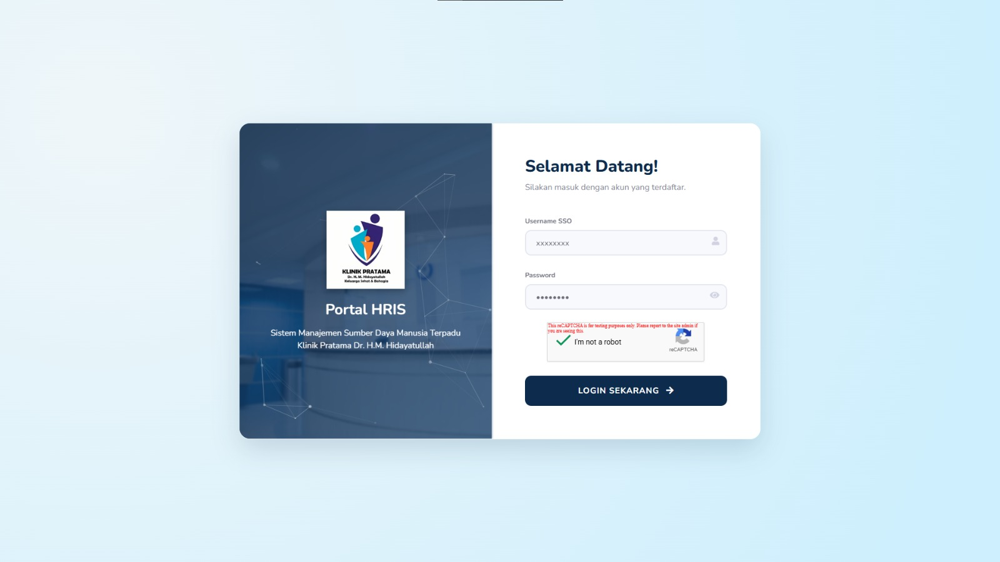
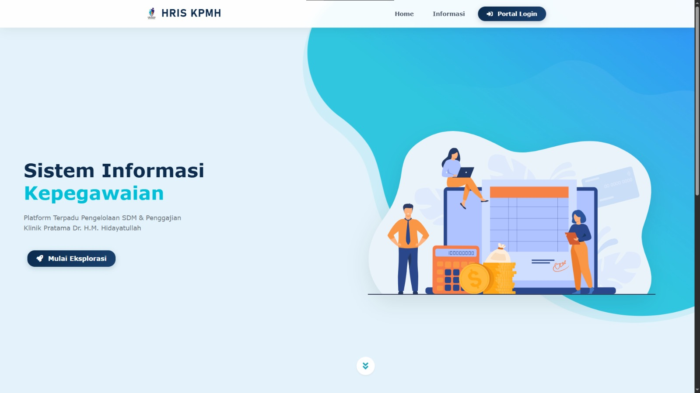
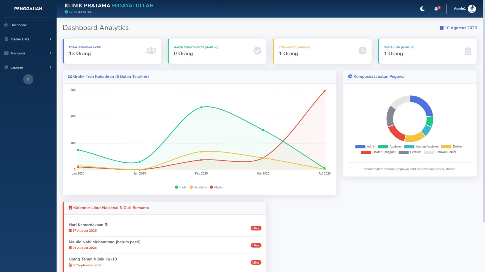

<div align="center">
  
  <h1>Enterprise HRIS & Payroll Management System</h1>
  <p>Sistem Informasi Manajemen Sumber Daya Manusia & Penggajian Terpadu <br> untuk Klinik Pratama Dr. H.M. Hidayatullah.</p>

  <!-- Badges -->
  <p>
    
    
    
    
    
  </p>
</div>

<br>

## 🚀 Gambaran Umum (*Project Overview*)
Aplikasi ini adalah **Sistem Informasi Kepegawaian (HRIS - Human Resource Information System)** berbasis Web yang dibangun menggunakan *framework* CodeIgniter 3. Secara khusus dirancang untuk memenuhi kelayakan standar skripsi dengan mengimplementasikan logika komputasi tingkat lanjut (*Advanced Computational Logic*), validasi silang otomatis (*Cross-Validation*), dan kualitas antarmuka sekelas perangkat lunak korporasi nyata (*Enterprise-grade UI/UX*).

---

## 🖨️ Modul Cetak Laporan Kelas Enterprise (*Smart Reporting*)
Aplikasi ini telah memenuhi standar kelayakan industri dan akademis dengan menyertakan **9+ Modul Laporan Kustom** yang didesain secara dinamis dan profesional:

1. **Laporan Rekapitulasi Gaji Tahunan (Annual Report):** Menggunakan logika *multi-looping* untuk mengkalkulasi kompilasi gaji, lembur, dan potongan seluruh pegawai selama setahun penuh.
2. **Laporan Rekapitulasi Lembur Pegawai:** Sinkronisasi cerdas dengan modul absensi harian untuk menyeleksi *fraud* (kecurangan) durasi lembur.
3. **Laporan Transaksi Potongan Gaji Bulanan:** Kalkulasi akumulatif denda Alpha dan potongan kustom lainnya.
4. **Modul Laporan Master:** Mencakup Laporan Data Pegawai, Jabatan, Absensi, Cuti, dan Gaji Bulanan.

**Fitur Canggih pada Hasil Cetakan (Print Out):**
- 🛡️ **Validasi QR Code (*Digital Signature*):** Dilengkapi otentikasi digital berbasis *Base64 QR Code* pada blok tanda tangan (menghilangkan ketergantungan tanda tangan basah).
- 💧 **Transparent Watermark:** Injeksi logo instansi secara transparan di pusat dokumen menggunakan CSS Print Media Query (Anti-Pemalsuan).
- 🔢 **Auto-Generated Reference Number:** Penomoran surat yang di-*generate* secara dinamis dan (*Real-time*) (misal: `Nomor: 260810/HRD-KPMH/VIII/2026`) menggunakan algoritma konversi *Month-to-Roman*.
- 🏛️ **Grid-based Kop Surat:** Susunan *Header* dokumen resmi berstruktur tabel untuk kompatibilitas cetak (*Print-safe Layout*) di berbagai ukuran kertas standar.

---

## ⚙️ Arsitektur Sistem & Backend (*Core Features*)
- 👥 **Manajemen Data Master Terpusat:** Pengelolaan struktural untuk Pegawai, Jabatan, Hak Akses, serta pengaturan komponen Gaji Pokok & Tunjangan operasional.
- ⏱️ **Smart Alpha & Attendance Logic:** Perekaman jam absensi dengan sistem kalkulasi ketidakhadiran (Alpha) otomatis, yang secara matematis menghitung sisa hari kerja valid seorang pegawai dalam sebulan.
- 🌙 **Fraud-Prevention pada Modul Lembur:** Fitur *Cross-Validation* yang secara aktif membandingkan durasi pengajuan lembur yang diizinkan HRD dengan **Waktu Pulang Aktual** pada mesin absensi. Jika pegawai pulang lebih awal, sistem secara sepihak memangkas kompensasi lembur.
- 🏝️ **Manajemen Cuti Terstruktur:** Siklus pengajuan cuti (*Request-Approve/Reject*) dua arah dengan fitur kolom catatan/pesan *feedback* langsung dari meja HRD.
- 📅 **Integrasi API Hari Libur Nasional:** *Pulling* data kalender libur secara *real-time* dari Github API (*APIHariLibur_V2*), mengeliminasi kebutuhan input tanggal merah manual setiap tahunnya.

---

## ✨ Rekayasa Antarmuka (*UI/UX Engineering*)
- 🌌 **Split-Screen Interactive Login:** Antarmuka masuk bergaya korporat modern dengan partikel animasi (*Particles.js*) yang bergerak dinamis merespon kursor.
- 🌓 **Persistent Dark Mode:** Pengalaman visual elegan yang aman bagi mata (*eye-strain free*), didukung memori penyimpanan status tema melalui `localStorage` (*Gapless Transition*).
- 🔔 **Asynchronous Notification Center:** Menerapkan **SweetAlert2** bertipe *Toast* untuk umpan balik (*Feedback*) cepat, serta menu *Dropdown Alert Center* di navbar untuk pemantauan aktivitas cuti/lembur.
- ⚡ **Seamless CRUD dengan Bootstrap Modal:** Fitur Tambah/Edit data menggunakan arsitektur Modal yang mencegah pemuatan ulang halaman utuh (*Full Page Reload*), meningkatkan persepsi kecepatan (*Perceived Performance*).

---

## 🛡️ Lapisan Keamanan (*Security Hardening*)
- 🔒 **Algoritma BCRYPT:** Migrasi total dari MD5 menuju *hashing* sandi BCRYPT (standar industri kriptografi modern).
- 🛡️ **Anti-CSRF (Cross-Site Request Forgery):** Injeksi *Security Token* pada semua lalu lintas formulir data (*POST method*).
- 🧹 **Global XSS Filtering:** Pembersihan skrip intrusif (*Sanitization*) pada setiap input untuk menangkal injeksi *Javascript/HTML*.
- 🛡️ **Prepared Statements (Query Binding):** Isolasi variabel terhadap *Query Database* demi mencegah eksploitasi peretasan *SQL Injection*.

---

## 💻 Panduan Instalasi (Environment Setup)
Ikuti instruksi teknis berikut untuk menjalankan sistem secara lokal:

1. **Kloning Repositori:**
   ```bash
   git clone https://github.com/NorisukiNZk/penggajian.git
   ```
2. **Inisialisasi Database:**
   - Aktifkan modul Apache & MySQL pada XAMPP/Laragon.
   - Buat basis data kosong dengan nama `penggajian` melalui antarmuka phpMyAdmin.
   - Lakukan proses impor (*Import*) pada berkas SQL primer yang disediakan dalam repositori.
3. **Konfigurasi Lingkungan (*Environment*):**
   - Modifikasi berkas `application/config/database.php`.
   - Sesuaikan parameter kredensial `hostname`, `username`, `password`, dan `database` sesuai lingkungan sistem lokal Anda.
4. **Eksekusi Aplikasi:**
   - Akses via browser: `http://localhost/penggajian/`
   - Gunakan kredensial *default* (terlampir pada data SQL) untuk mencoba hak akses *Admin* atau *Pegawai*.

---

## 📸 Dokumentasi Antarmuka (System Screenshots)

- **Antarmuka Otentikasi (Login):** 
- **Dasbor Utama (Admin Dashboard):** 
- **Modul Penggajian (Payroll):** 

---
<div align="center">
  Didedikasikan untuk Tugas Akhir & Standardisasi Skripsi IT. <br>
  <strong>&copy; 2026 NorisukiNZK</strong>
</div>
