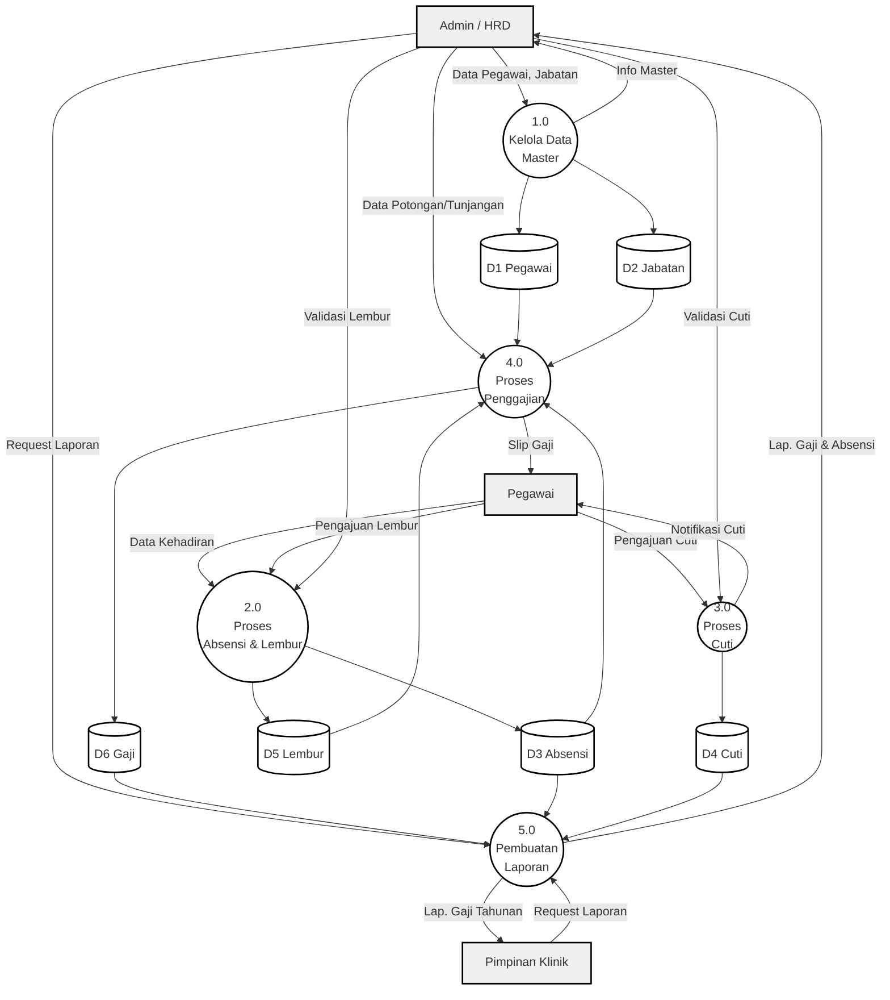
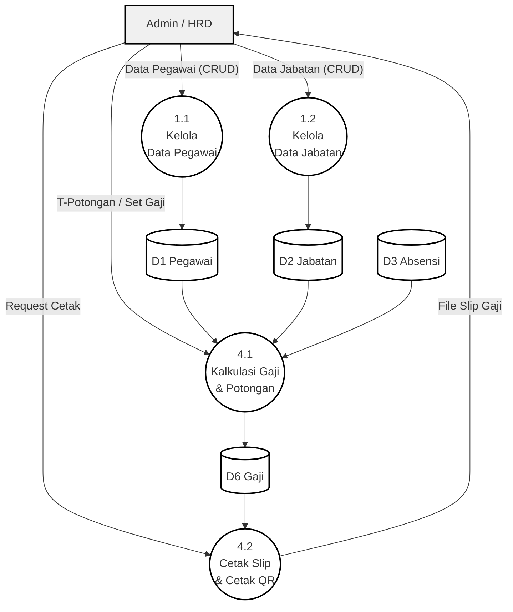
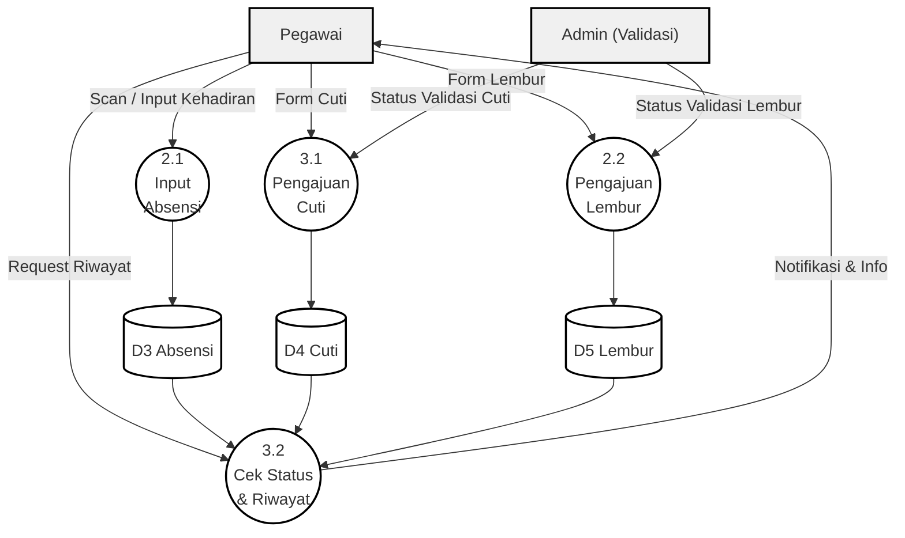

# Kumpulan Data Flow Diagram (DFD)

Berikut adalah _source code_ Mermaid untuk **DFD Level 1**, **DFD Level 2 (Fokus Admin)**, dan **DFD Level 3 (Fokus Pegawai)**. Anda dapat me-_copy-paste_ masing-masing kode blok ini ke [Mermaid Live Editor](https://mermaid.live/) seperti sebelumnya untuk mengubahnya menjadi gambar.

---

## 1. DFD Level 1 (Diagram Utama)
Menjabarkan proses-proses utama di dalam sistem. Terdapat 5 proses utama: Kelola Data Master, Proses Absensi & Lembur, Proses Cuti, Proses Penggajian, dan Pembuatan Laporan.

---

## 2. DFD Level 2 (Fokus Admin)
Memecah/menjabarkan proses `1.0 Kelola Data Master` dan proses `4.0 Proses Penggajian` menjadi aktivitas yang lebih detail dari sisi Admin HRD.

---

## 3. DFD Level 3 (Fokus Pegawai)
Memecah/menjabarkan proses `2.0 Absensi` dan `3.0 Cuti` menjadi aktivitas yang lebih detail dari sisi Pegawai. Secara penamaan akademis ini biasanya disebut DFD Level 2 untuk Proses 2.0 & 3.0, namun kita beri label sesuai konteks Pegawai.

