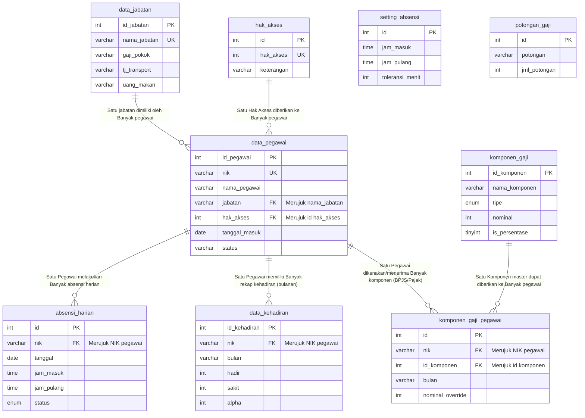

# Entity Relationship Diagram (Relasi Antar Tabel)

Berikut adalah *source code* Mermaid untuk membuat gambar desain ERD (Relasi Tabel) aplikasi penggajian klinik Anda. 

Anda dapat meng-_copy_ blok kode di bawah ini lalu melakukan _paste_ ke situs **[Mermaid Live Editor](https://mermaid.live/)** untuk mendapatkan gambar relasinya dalam bentuk JPG atau PNG yang sangat rapi.

