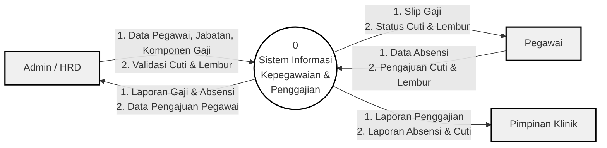

# Diagram Konteks Sistem Informasi Penggajian

Berikut adalah *source code* Mermaid untuk diagram konteks aplikasi (DFD Level 0). Anda dapat menggunakan diagram ini di editor Markdown yang mendukung Mermaid (seperti VS Code, Typora, Obsidian) atau menyalin kode di bawah ini ke situs [Mermaid Live Editor](https://mermaid.live/) untuk mengekspornya menjadi format JPG/PNG beresolusi tinggi untuk keperluan naskah skripsi Anda.

